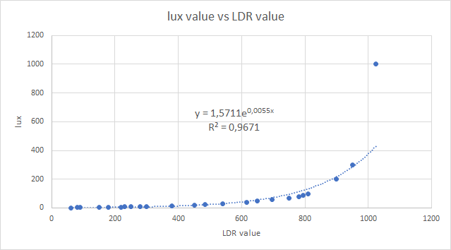

# Mad Turkey Weather Network
Mad Turkey is a simple PHP based weather service with NodeMCU weather station clients

## Clients
We used the NodeMCU microcontroller with WIFI support for our weather clients but you
can use also a different microcontroller if it supports WIFI.

We use the [Arduino IDE](https://www.arduino.cc/en/Main/Software) to upload the code to our
microcontroller. We used the following libraries which you can donload from the download more
libraries menu:

- ESP8266 board libraries
- DHT library
- ArduinoJson library

When you want to upload your code to the client you need to rename `config.example.h`
to `config.h` and fill in your client details to make a connection with the server.

Here below is a breadboard scheme of the client:


## Client Calibration
You can use a light meter to calibrate your ldr values to lux units. You do this by measuring the value of the ldr under different light intensities. Then you measure the same light intensity with the light meter in lux. You do this multiple times for better accuracy. After you are done measuring, you compare the values in a graph to get a formula.

*Graph example:*



## Client case
We have also designed a simple case which you can lazer cut in a plywood board.

In the first pass you need to cut the blue strokes and in the second pass you need to cut the red strokes.

After you are done cutting, you can glue the pieces together with wood glue.


## Server
When you want to install the server you need to rename `config.example.php`
to `config.php` and fill in your server details to make a connection with the database.

## Users
You can register multiple users. Every user has a permission / role field. There are three roles:

- Viewer: Can view all the data
- Moderator: Can view and edit all the data except users and sessions
- Admin: Can view and edit everything

## Stations
You can create multiple virtual stations with geo locations. Every station has a API key which you
can use to send information from the client to the server. That data is then sorted via the key to
the right station and is drawn in the charts.

## Events
You can script events in PHP with these variables:

```
$absolute_time = Seconds that has passed since 1 January 1970 a.k.a unix epoch
$time = Seconds that has passed since the start of the day at 00:00:00
$temperature = Current measured temperature in degrees Celcius
$humidity = Current measured humidity in procent
$light = Current measured light in procent
$outside_temperature = Current outside measured temperature in procent
$outside_humidity = Current outside measured humidity in procent
```

With events you can trigger:

- A yellow LED
- A beeper / buzzer
